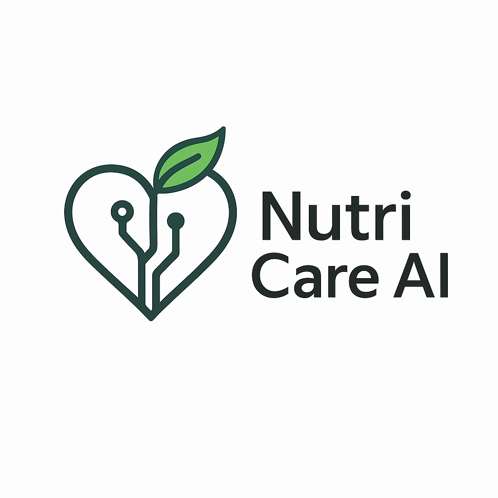

# 🌿 NutriCare AI – Personalized Dietary Recommendations with RAG


[](https://opensource.org/licenses/MIT)
[]()
[]()
[]()
[]()
[]()

**NutriCare AI** is a personalized nutrition recommendation web application powered by Retrieval-Augmented Generation (RAG). It provides custom diet plans based on a user's health conditions (e.g., diabetes, high blood pressure) and allergies (e.g., dairy, gluten). Designed for healthcare-conscious individuals and professionals, it intelligently queries curated medical nutrition articles to suggest optimal meal plans tailored to each patient's needs.

---

## 🚀 Features

- ✅ Input diagnosis + allergy via natural language
- 🧠 Retrieval-Augmented Generation for contextual dietary planning
- 🔍 Real-time querying of health-specific article databases
- 🥗 Personalized recommendations using AI-driven text understanding
- 🌐 Modern UI with React frontend
- 📊 Scalable with **ChromaDB** vector database

---

## 🛠️ Tech Stack

| Frontend | Backend | AI Model | Database | Web Scraping |
|----------|---------|----------|----------|--------------|
| React.js | Flask / FastAPI | LangChain + OpenAI (RAG) | **ChromaDB** | BeautifulSoup |

---

## 📷 Demo


---

## 🧩 System Architecture

```plaintext
User Input → React UI → Flask API → LangChain Query
         → Article Context via ChromaDB
         → RAG Engine → AI Response → Personalized Diet Plan
